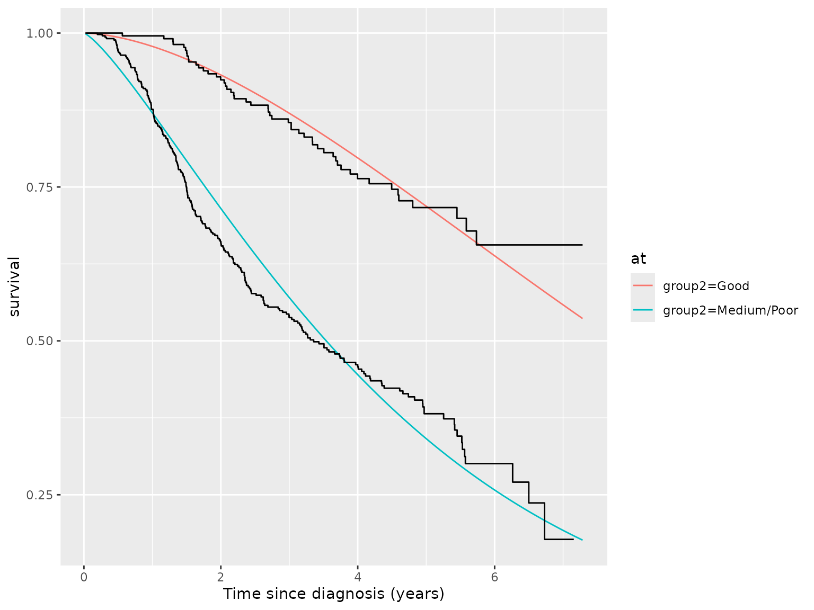
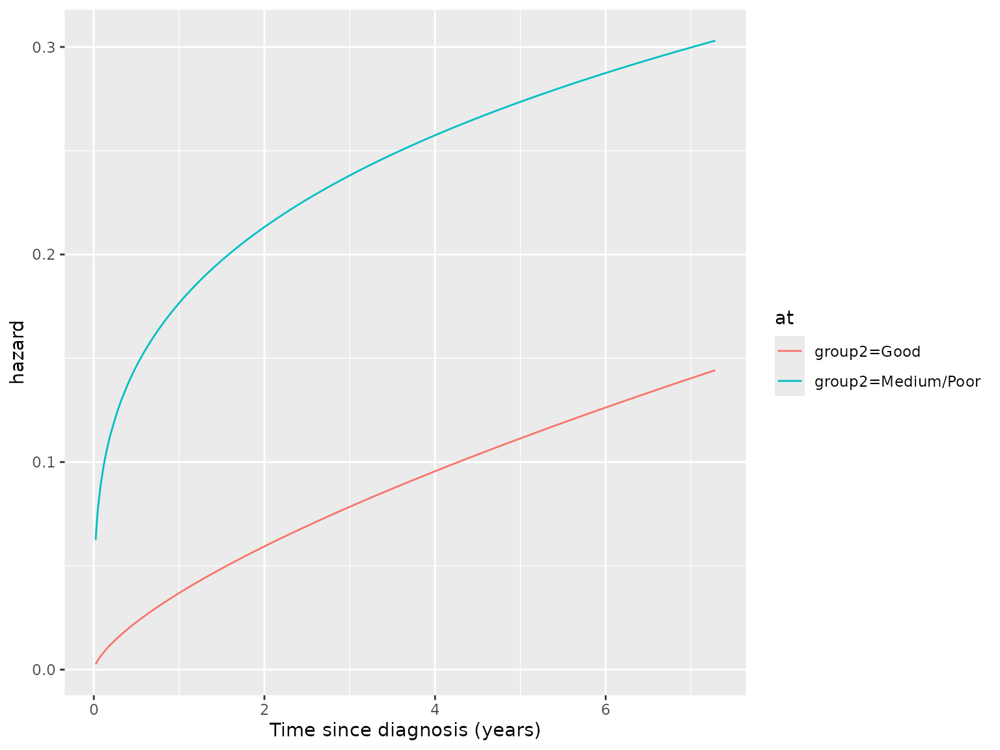

# Calculating standardized survival measures in flexsurv

## Background

### Standardized survival measures

`standsurv` is a post-estimation command that takes a `flexsurvreg`
object and calculates standardized survival measures. After fitting a
parametric survival model in `flexsurv` it is often useful to compute
and visualise the marginal (or standardized) survival. For example,
suppose a survival model is fitted adjusted for treatment group, age,
and sex. A separate predicted survival curve can be obtained for each
individual based on their covariate pattern or a prediction can be
obtained by setting covariates to their mean values (both can be
obtained using `summary.flexsurvreg`), but it may be more useful to
obtain the marginal survival for each treatment group. Regression
standardization achieves this by fitting a regression model including
the treatment group $Z$, covariates $X$ and possible interactions
between $X$ and $Z$. The standardized survival can be estimated by
obtaining predictions for every individual in the study under each fixed
treatment arm and averaging these individual-specific estimates. The
marginal survival over the distribution of covariates in the study
assuming all participants were assigned to arm $Z = z$ is:
$$S_{s}\left( t|Z = z \right) = E\left\lbrack S\left( t|Z = z,X \right) \right\rbrack = \frac{1}{N}\sum\limits_{i = 1}^{N}S\left( t|Z = z,X = x_{i} \right)$$
for covariate values (vectors) $x_{1},...,x_{N}$. Here standarization is
done over all $N$ patients in the study and provides a counterfactual
marginal estimate when setting $Z = z$. The standardized survival is
therefore an estimate of the marginal survival if all study patients had
been assigned to group $z$. Under certain assumptions, differences in
marginal survival provide estimates of causal effects (Syriopoulou,
Rutherford, and Lambert (2021)) and certain estimands such as the
average treatment effect (ATE) can be targeted:
$$ATE = S_{s}\left( t|Z = z_{1} \right) - S_{s}\left( t|Z = z_{0} \right)\rbrack$$
Alternatively, an average treatment effect in the treated (ATET)
estimand can be targeted by averaging over only patients who were in the
intervention treatment arm $Z = z_{1}$. Standardization estimates can
also be obtained for other target populations of interest. For example
it may be important to predict survival in an external population with
different characteristics to the study population.

The hazard function for the standardized survival can be obtained to
understand how the shape of the hazard changes over time. This provides
an estimate of the marginal hazard. It can be shown (Rutherford et al.
(2020), Appendix I) that the hazard of the standardized survival can be
calculated as
$$h_{s}\left( t|Z = z \right) = \frac{\sum\limits_{i = 1}^{N}S\left( t|Z = z,X = x_{i} \right)h\left( t|Z = z,X = x_{i} \right)}{\sum\limits_{i = 1}^{N}S\left( t|Z = z,X = x_{i} \right)}$$
This is a weighted average of the $N$ individual hazard functions,
weighted by the probability of survival at time $t$. Patients who are
unlikely to have survived to $t$ will contribute less weight to this
hazard function.

### Calculating marginal expected survival and hazard

In economic evaluations parametric survival models are used to
extrapolate clinical trial data to estimate lifetime benefits. In this
context it is often useful to plot marginal ‘expected’ (general
population) survival alongside parametric models fitted and extrapolated
from trial data in order to aid interpretation and for a visual
comparison between the trial subjects and the population at large.
Displaying expected survival and hazard functions can aid understanding
of whether the assumed hazard and survival functions are credible
(Rutherford et al. (2020)). Expected survival is defined as the
all-cause survival in a general population with the same key
characteristics as the study subjects. General population mortality
rates are often taken from national lifetables that are stratified by
age, sex, calendar year and occasionally other prognostic factors
(e.g. deprivation indices).

The Ederer or “exact” method for estimating expected survival assumes
subjects in the trial population are not censored before the end of a
stated follow-up time (Ederer, Axtell, and Cutler 1961). The expected
survival is then the survival we would expect to see in an age-sex
matched general population if all patients are continuously followed-up.
This is the approach used by `standsurv` to calculate expected survival
and is the “most appropriate when doing forcasting, sample size
calculations or other predictions of the ‘future’ where censoring is not
an issue” (Therneau 1999).

Based on the exact method, the marginal expected survival using
background mortality rates is calculated using all $N$ patients in the
trial at any time point $t$:

$$S^{*}(t) = \frac{1}{N}\sum\limits_{i = 1}^{N}S_{i}^{*}(t)$$ where
$S_{i}^{*}(t)$ is the expected survival for the $i$th subject at time
$t$. It follows that the marginal expected hazard is a weighted average
of the expected hazard rates:
$$h^{*}(t) = \frac{\sum\limits_{i = 1}^{N}S_{i}^{*}(t)h_{i}^{*}(t)}{\sum\limits_{i = 1}^{N}S_{i}^{*}(t)}$$

The expected survival for the $i$th subject at follow-up time $t$ is
calculated based on matching to the general population hazard rates. If
lifetables are utilised these often provide mortality rates by sex
($s$), age ($a$) and calendar year ($y$), in yearly or 5-yearly
categories. In practice the expected survival at time $t$ for a given
subject is calculated from the cumulative hazard. At a given follow-up
time $t$ this is the sum of
$h_{asy}^{*} \times {\text{Number of days in state}\mspace{6mu}}(a,s,y)$
in the follow-up where $h_{asy}^{*}$ is the expected hazard for age $a$,
sex $s$, year $y$. This requires follow-up time for each individual in
the study dataset to be split by multiple timescales (e.g. age and year)
into time epochs, which can be visualised as a Lexis diagram. Each epoch
can then be matched to a corresponding expected mortality rate.

### Incorporation of background mortality into survival models

Incorporating background mortality into survival models directly is
recommended as it helps avoid extremely implausible projections
(Rutherford et al. (2020)). This can be done using an excess mortality /
relative survival model where population based ‘expected’ rates, often
from life tables, are introduced to explain background mortality. The
concept behind these models is to partition the all-cause mortality into
excess mortality caused by the disease of interest and that due to other
causes. A parametric model can then be applied to the isolated excess
mortality. This may be particularly useful when making long-term
extrapolations as the pattern of disease-specific mortality and other
cause mortality are likely to be very different over time.
Alternatively, if cause of death information is available and reliable,
a separate cause-specific model can be fitted to the disease-specific
mortality and other cause mortality.

The all-cause mortality rate at time $t$ for individual $i$ can be
partitioned into two constituent parts:
$$h_{i}(t) = h_{i}^{*}(t) + \lambda_{i}(t)$$ where $h_{i}(t)$ is the
all-cause mortality rate (hazard), $h_{i}^{*}(t)$ is the expected or
background mortality rate and $\lambda_{i}(t)$ is the excess mortality
rate. Equivalently, the hazard rates can be transformed to the survival
scale which gives the all-cause survival at time $t$ as the product of
the expected survival and the relative survival:
$$S_{i}(t) = S_{i}^{*}(t)R_{i}(t)$$ The relative survival, $R_{i}(t)$,
is therefore the ratio of all-cause survival and the expected survival
in the background population. Typically, $h_{i}^{*}(t)$ (and hence
$S_{i}^{*}(t)$) are obtained from population lifetables. The expected
mortality rates are assumed to be fixed and known and a parametric model
is then used to estimate the relative survival (or equivalently excess
hazard).

## `standsurv`

`standsurv` is a post-estimation command that takes a `flexsurv`
regression and calculates standardized survival measures and contrasts.
Expected mortality rates and survival can also be obtained. The main
features of the command are that it enables the calculation and plotting
over any specified follow-up times of

1.  Marginal survival, hazard and restricted mean survival time (RMST)
    metrics
2.  Marginal expected (population) survival and hazard functions matched
    to the study population
3.  Marginal all-cause survival and all-cause hazard after fitting
    relative survival models
4.  Contrasts in survival, hazard and RMST metrics (e.g. marginal hazard
    ratio, differences in marginal RMST)
5.  Confidence intervals and standard errors for all measures and
    contrasts using either the delta method or bootstrapping

Through a simple syntax the user can specify the groups that they wish
to calculate the marginal metrics. These groups can be formed by any
combination of covariate values.

### A worked example: the pbc dataset

For this example we will use data from the German Breast Cancer Study
Group 1984-1989, which is the R dataset `bc` found in the `flexsurv`
package. This dataset has death, or censoring times for 686 primary node
positive breast cancer patients together with a 3-level prognostic group
variable with levels “Good”, “Medium” and “Poor”. For this demonstration
we collapse the prognostic variable into 2 levels: “Good” and
“Medium/Poor”. We also create some artificial ages and diagnosis dates
for the patients, along with assuming all patients are female. We allow
a correlation between the age at diagnosis for a patient and their
survival time so that age is a prognostic variable. The mean age is 65
with a standard deviation of 5. We load this dataset and create these
additional variables.

``` r
library(flexsurv)
library(flexsurvcure)
library(ggplot2)
library(dplyr)
library(survminer)
```

``` r
data(bc)
set.seed(236236)
## Age at diagnosis is correlated with survival time. A longer survival time 
## gives a younger mean age
bc$age <- rnorm(dim(bc)[1], mean = 65 - scale(bc$recyrs, scale=F), sd = 5)
## Create age at diagnosis in days - used later for matching to expected rates
bc$agedays <- floor(bc$age * 365.25)
## Create some random diagnosis dates between 01/01/1984 and 31/12/1989
bc$diag <- as.Date(floor(runif(dim(bc)[1], as.Date("01/01/1984", "%d/%m/%Y"), 
                               as.Date("31/12/1989", "%d/%m/%Y"))), 
                   origin="1970-01-01")
## Create sex (assume all are female)
bc$sex <- factor("female")
## 2-level prognostic variable
bc$group2 <- ifelse(bc$group=="Good", "Good", "Medium/Poor")
head(bc)
#>   censrec rectime group   recyrs      age agedays       diag    sex group2
#> 1       0    1342  Good 3.676712 64.38839   23517 1986-09-15 female   Good
#> 2       0    1578  Good 4.323288 67.31488   24586 1986-08-12 female   Good
#> 3       0    1760  Good 4.821918 61.77993   22565 1985-11-10 female   Good
#> 4       0    1152  Good 3.156164 65.20415   23815 1987-02-28 female   Good
#> 5       0     967  Good 2.649315 68.74975   25110 1986-05-18 female   Good
#> 6       0     629  Good 1.723288 64.53328   23570 1987-03-07 female   Good
```

A plot of the Kaplan-Meier shows a clear separation in the survival
curves between the two prognostic groups.

``` r
km <- survfit(Surv(recyrs, censrec)~group2, data=bc)
kmsurvplot <- ggsurvplot(km) 
#> Warning: Using `size` aesthetic for lines was deprecated in ggplot2 3.4.0.
#> ℹ Please use `linewidth` instead.
#> ℹ The deprecated feature was likely used in the ggpubr package.
#>   Please report the issue at <https://github.com/kassambara/ggpubr/issues>.
#> This warning is displayed once every 8 hours.
#> Call `lifecycle::last_lifecycle_warnings()` to see where this warning was
#> generated.
kmsurvplot + xlab("Time from diagnosis (years)")
#> NULL
```

### A stratified Weibull model

We start by fitting a Weibull model to each group separately. One way to
do this is to fit a single saturated model whereby group affects both
the scale and shape parameters of the Weibull distribution. This
effectively means we have a separate scale and shape parameter for each
group, which is equivalent to fitting two separate models. Such a model
does not make a proportional hazards assumption and hence the hazard
ratio will change over time. The saturated model approach has advantages
as we can use the model to easily investigate treatment effects using
`standsurv` as we shall see later. Including group in the main formula
of `flexsurvreg` allows group to affect the scale parameter of the
Weibull distribution whilst we use the `anc` argument in `flexsurvreg`
to additionally allow group to affect the shape parameter.

``` r
model.weibull.sep <- flexsurvreg(Surv(recyrs, censrec)~group2, 
                                 anc = list(shape = ~ group2), 
                                 data=bc, dist="weibullPH")
model.weibull.sep
#> Call:
#> flexsurvreg(formula = Surv(recyrs, censrec) ~ group2, anc = list(shape = ~group2), 
#>     data = bc, dist = "weibullPH")
#> 
#> Estimates: 
#>                           data mean  est       L95%      U95%      se      
#> shape                           NA    1.68681   1.32989   2.13952   0.20461
#> scale                           NA    0.02187   0.01119   0.04274   0.00748
#> group2Medium/Poor          0.66618    1.84846   1.14534   2.55157   0.35874
#> shape(group2Medium/Poor)   0.66618   -0.28237  -0.54219  -0.02254   0.13257
#>                           se.robust  exp(est)  L95%      U95%    
#> shape                      0.14443         NA        NA        NA
#> scale                      0.00552         NA        NA        NA
#> group2Medium/Poor          0.26623    6.35001   3.14351  12.82725
#> shape(group2Medium/Poor)   0.09374    0.75400   0.58147   0.97771
#> 
#> N = 686,  Events: 299,  Censored: 387
#> Total time at risk: 2113.425
#> Log-likelihood = -830.4043, df = 4
#> AIC = 1668.809
```

Given that the model only contains `group2` and no other covariates we
can obtain the predicted (fitted) survival for each of the two groups
using the `summary` function and storing these predictions in a tidy
data.frame with the argument `tidy=T`.

``` r
predictions <- summary(model.weibull.sep, type = "survival", tidy=T)
ggplot() + geom_line(aes(x=time, y=est, color = group2), data=predictions) + 
  geom_step(aes(x=time, y=surv, group=strata), data=kmsurvplot$data.survplot)
```


The Weibull model does not appear to fit the data very well and so we
should try other parametric distributions. However, for illustration
purposes we shall continue using the Weibull model. We will now show
that the same predictions can be obtained from `standsurv` but with the
benefit of addition flexibility.

### Using `standsurv` to calculate marginal survival

`standsurv` works similarly to the `margins` command in `R` and
`standsurv` in Stata by allowing the user to specify a list of scenarios
in which specific covariates are fixed to certain values. This is done
using the `at` argument of `standsurv` to provide the list of scenarios
where each scenario is itself a list containing covariates that are to
be fixed. In our worked example the two scenarios are
`list(group2 = "Good")` and `list(group2 = "Medium/Poor")`. Any
covariates not specified in the `at` scenarios are averaged over, hence
creating marginal, or standardized, estimates of the metric of interest.
In the example above, there are no other covariates in the model so we
will get the same answer as obtained from `summary`. But the later
worked example extends this to models containing other covariates. The
default is to calculate survival probabilities at the event times in the
data but this can be changed with the `type` and `t` arguments,
respectively. The returned object is a tidy data.frame with columns
named `at1` up to `atn` for the n scenarios specified in the `at`
argument.

``` r
ss.weibull.sep.surv <- standsurv(model.weibull.sep,
                                             type = "survival",
                                             at = list(list(group2 = "Good"),
                                                       list(group2 = "Medium/Poor")))
ss.weibull.sep.surv
#> # A tibble: 574 × 3
#>      time   at1   at2
#>     <dbl> <dbl> <dbl>
#>  1 0.0219 1.000 0.999
#>  2 0.0411 1.000 0.998
#>  3 0.0438 1.000 0.997
#>  4 0.0466 1.000 0.997
#>  5 0.0493 1.000 0.997
#>  6 0.0795 1.000 0.994
#>  7 0.115  0.999 0.991
#>  8 0.126  0.999 0.990
#>  9 0.156  0.999 0.987
#> 10 0.173  0.999 0.985
#> # ℹ 564 more rows
```

Further details such as labels for the `at` scenarios are stored in
attributes of the `standsurv` object. These are utilised by the `plot`
function. A plot of the marginal estimates can be easily produced using
the `plot` function, which produces a `ggplot` object.

``` r
plot(ss.weibull.sep.surv)
```


The plot can be easily further manipulated, for example by changing axis
labels and adding further plots.

``` r
plot(ss.weibull.sep.surv) + xlab("Time since diagnosis (years)") +
  geom_step(aes(x=time, y=surv, group=strata), data=kmsurvplot$data.survplot)
```



### Other metrics: marginal hazards and marginal RMST

We can use the `type` argument to calculate marginal hazards or
restricted mean survival time (RMST). For example a plot of the hazard
functions for the two groups is obtained as follows:

``` r
ss.weibull.sep.haz <- standsurv(model.weibull.sep,
                                            type = "hazard",
                                            at = list(list(group2 = "Good"),
                                                      list(group2 = "Medium/Poor")))
plot(ss.weibull.sep.haz) + xlab("Time since diagnosis (years)")
```



Whilst a plot of RMST is given by

``` r
ss.weibull.sep.rmst <- standsurv(model.weibull.sep,
                                             type = "rmst",
                                             at = list(list(group2 = "Good"),
                                                       list(group2 = "Medium/Poor")))
plot(ss.weibull.sep.rmst) + xlab("Time since diagnosis (years)")
```


### Calculating contrasts

The advantage of fitting a saturated model now becomes clear as we can
calculate contrasts between our `at` scenarios. Suppose we are
interested in the difference in the survival functions between the two
groups. This is easily calculated using the `contrast = "difference"`
argument, and a plot of the contrast can be obtained using
`contrast = TRUE` argument in the `plot` function.

``` r
ss.weibull.sep.3 <- standsurv(model.weibull.sep,
                                          type = "survival",
                                                 at = list(list(group2 = "Good"),
                                                           list(group2 = "Medium/Poor")),
                                          contrast = "difference")
plot(ss.weibull.sep.3, contrast=TRUE) + xlab("Time since diagnosis (years)") +
  ylab("Difference in survival probabilities")  + geom_hline(yintercept = 0)
```


Alternatively, we may wish to visualise the implied hazard ratio from
fitting separate Weibull models to the two groups. In the breast cancer
example we see that the hazard ratio (treatment effect) starts very high
before decreasing, suggesting that those with Medium/Poor prognosis
start with a high elevated risk but have a continued excess risk up to
the end of follow-up, compared to those with Good prognosis.

``` r
ss.weibull.sep.4 <- standsurv(model.weibull.sep,
                                          type = "hazard",
                                                 at = list(list(group2 = "Good"),
                                                           list(group2 = "Medium/Poor")),
                                          contrast = "ratio")
plot(ss.weibull.sep.4, contrast=TRUE) + xlab("Time since diagnosis (years)") +
  ylab("Hazard ratio") + geom_hline(yintercept = 1)
```


### Confidence intervals and standard errors

Confidence intervals and standard errors for both the metric of interest
and contrasts can be obtained either through bootstrapping or using the
delta method. Bootstrap confidence intervals are calculated by
specifying `ci = TRUE`, `boot = TRUE`, and providing the number of
bootstrap samples using `B`. We can also set the seed using the `seed`
argument to allow reproducibility.

If instead the delta method is to be used to obtain confidence intervals
then we specify `ci = TRUE`, `boot = FALSE`. The delta method obtains
confidence intervals by calculating standard errors for a given
transformation of the metric of interest and then assuming normality.
The default is to use a log transformation; hence if `type = "survival"`
the confidence intervals are symmetric for the log survival
probabilities. Alternative transformations can be specified using the
`trans` argument.

The code below shows confidence intervals for marginal survival
calculated through a bootstrap method (with `B = 100`) compared to a
delta method. For computational efficiency here we only predict for 10
time points.

``` r
ss.weibull.sep.boot <- standsurv(model.weibull.sep,
                                          type = "survival",
                                                 at = list(list(group2 = "Good"),
                                                           list(group2 = "Medium/Poor")),
                                          t = seq(0,7,length=10),
                                          ci = TRUE,
                                          boot = TRUE,
                                          B = 100,
                                          seed = 2367)
#> Calculating bootstrap standard errors / confidence intervals

ss.weibull.sep.deltam <- standsurv(model.weibull.sep,
                                          type = "survival",
                                                 at = list(list(group2 = "Good"),
                                                           list(group2 = "Medium/Poor")),
                                          t = seq(0,7,length=10),
                                          ci = TRUE,
                                          boot = FALSE)
#> Calculating standard errors / confidence intervals using delta method

plot(ss.weibull.sep.boot, ci = TRUE) +  
  geom_ribbon(aes(x=time, ymin=survival_lci, ymax=survival_uci, color=at, linetype = "Delta method"), fill=NA,
              data=attr(ss.weibull.sep.deltam,"standpred_at")) +
  scale_linetype_manual(values = c("Bootstrap" = "solid", "Delta method"= "dashed")) +
  ggtitle("Comparison of bootstrap and delta method confidence intervals")
#> Scale for linetype is already present.
#> Adding another scale for linetype, which will replace the existing scale.
#> Warning: Removed 20 rows containing missing values or values outside the scale range
#> (`geom_line()`).
```


### Adding age as a covariate

Suppose age has been added as a covariate to the survival model. If age
is not included in our `at` scenarios `standsurv` will by default
produce standardized estimates of survival averaged over the age
distribution in our study population. Alternatively we could pass a new
prediction dataset to `standsurv` and obtain standardized estimates for
this population. As an example, we obtain marginal survival estimates
after fitting a stratified Weibull model, firstly standardized to the
age-distribution of our study population and secondly standardized to an
older population with mean age of 75 and standard deviation 5.

``` r
model.weibull.age.sep <- flexsurvreg(Surv(recyrs, censrec)~group2 + age, 
                                 anc = list(shape = ~ group2 + age), 
                                 data=bc, dist="weibullPH")

## Marginal survival standardized to age distribution of study population
ss.weibull.age.sep.surv <- standsurv(model.weibull.age.sep,
                                             type = "survival",
                                             at = list(list(group2 = "Good"),
                                                       list(group2 = "Medium/Poor")),
                                             t = seq(0,7,length=50)
)

## Marginal survival standardized to an older population
# create a new prediction dataset as a copy of the bc data but whose ages are drawn from
# a normal distribution with mean age 75, sd 5.
newpred.data <- bc
set.seed(247)
newpred.data$age = rnorm(dim(bc)[1], 75, 5)
ss.weibull.age2.sep.surv <- standsurv(model.weibull.age.sep,
                                             type = "survival",
                                             at = list(list(group2 = "Good"),
                                                       list(group2 = "Medium/Poor")),
                                             t = seq(0,7,length=50),
                                             newdata=newpred.data)

## Overlay both marginal survival curves
plot(ss.weibull.age.sep.surv) + 
  geom_line(aes(x=time, y=survival, color=at, linetype = "Older population"),
            data = attr(ss.weibull.age2.sep.surv, "standpred_at") ) +
  scale_linetype_manual(values = c("Study" = "solid", "Older population"= "dashed"))
#> Scale for linetype is already present.
#> Adding another scale for linetype, which will replace the existing scale.
```


### Calculating expected survival and hazard in `standsurv`

To overlay marginal expected survival or hazard curves we require a
lifetable of population hazard rates. To demonstrate we use the US
lifetable that comes with the `survival` package, called `survexp.us`.
Other lifetables can be obtained directly from the Human Mortality
Database (HMD) using the `HMDHFDplus` package.

The `survexp.us` lifetable is a `ratetable` object with stratification
factors age, sex and year. It gives rates of mortality per person-day
for combinations of the stratification factors. A summary of the
`survexp.us` object shows that the time-scale is in days.

``` r
summary(survexp.us)
#>  Rate table with 3 dimensions:
#>  age ranges from 0 to 39812.25; with 110 categories
#>  sex has levels of: male female
#>  year ranges from 1940-01-01 to 2020-01-01; with 81 categories
```

To use the lifetable to get expected rates for our trial population we
need to match age, sex and year variables in our dataset to those in the
ratetable. We can use the `rmap` argument to do this. `standsurv`
utilises the `survexp` function in the `survival` package to calculate
expected survival over the times specified in `t` using the ‘exact’
method of Ederer. We note that sex in our data is coded the same as in
the `ratetable` (“male” and “female”) and importantly that we have
variables that record both age at diagnosis and diagnosis date in days.
It is important that the user ensures that the study data are correctly
coded and have variables on the same timescale as in the `ratetable` so
that matching is successful. The code below demonstrates that for our
data we therefore need to match the `year` variable in the `ratetable`
to the `diag` variable in our study data, and the `age` variable in the
`ratetable` to the `agedays` variable in our study data.

We need to specify three more arguments in `standsurv`. First, the
lifetable, which must be a `ratetable` object and is specified using the
`ratetable` argument. Second, we may need to pass our trial dataset to
`standsurv` if the stratifying factors do not appear as covariates in
the `flexsurv` model. Finally, we need to be careful to tell `standsurv`
what the time scale transformation is between the fitted `flexsurv`
model and the time scale in `ratetable`. We can use the
`scale.ratetable` argument to do this. Typically ratetable objects are
expressed in days (e.g. rates per person-day). The default is therefore
`scale.ratetable = 365.25`, which indicates that the survival model was
fitted in years but the ratetable is in days.

After running `standsurv` we can plot the expected survival (or hazard)
by using the argument `expected = TRUE` in the
[`plot()`](https://rdrr.io/r/graphics/plot.default.html) function.

``` r
ss.weibull.sep.expected <- standsurv(model.weibull.sep,
                                                 type = "survival",
                                                 at = list(list(group2 = "Good"),
                                                           list(group2 = "Medium/Poor")),
                                                 t = seq(0,7,length=50),
                                                 rmap=list(sex = sex,
                                                           year = diag,
                                                           age = agedays
                                                 ),
                                                 ratetable = survexp.us,
                                                 scale.ratetable = 365.25,
                                                 newdata = bc
)
#> Calculating marginal expected survival and hazard
plot(ss.weibull.sep.expected, expected = T)
```


We can see that the marginal expected survival is much higher than the
marginal (predicted) survival for our breast cancer population. We can
also obtain the expected hazards:

``` r
ss.weibull.sep.expectedh <- standsurv(model.weibull.sep,
                                                 type = "hazard",
                                                 at = list(list(group2 = "Good"),
                                                           list(group2 = "Medium/Poor")),
                                                 t = seq(0,7,length=50),
                                                 rmap=list(sex = sex,
                                                           year = diag,
                                                           age = agedays
                                                 ),
                                                 ratetable = survexp.us,
                                                 scale.ratetable = 365.25,
                                                 newdata = bc
)
#> Calculating marginal expected survival and hazard
plot(ss.weibull.sep.expectedh, expected = T)
```


The hazard plot shows that our model is predicting an increasing hazard
over time for the cancer population, which remains significantly higher
than the expected hazard in the general population. The monotonically
increasing hazard imposed by the Weibull distribution may be implausible
and this may make us question the suitability of a Weibull model if we
wish to extrapolate.

### Incorporation of background mortality

A relative survival model can be fitted using `flexsurv` by
incorporating background mortality rates. The model then estimates
excess hazard rates and relative survival measures. For prediction
purposes, following the fitting of a relative survival model,
`standsurv` allows the user to either obtain marginal predictions of
relative survival / excess hazard or of all-cause survival / all-cause
hazard. The latter are calculated by multiplying relative survival
estimates with expected survival to get all-cause survival, or by adding
excess hazard rates to expected hazard to get all-cause hazard.

We demonstrate this by fitting a relative survival cure model to the
breast cancer data and obtaining predicted all-cause survival and
all-cause hazard up to 30-years after diagnosis. A mixture cure model
makes the assumption that a proportion of the study population will
never experience the event. In a relative survival framework the cure
model assumes that the excess mortality rate approaches zero (or
equivalently the relative survival reaches an asymptote determined by
the cure fraction). We fit a relative survival cure model with a Weibull
distribution assumed for the uncured.

The relative survival mixture-cure model is fitted below. We must pass
to `flexsurvcure` the expected hazard rates at the event / censoring
time for each individual, as it is the expected rates at the event times
that are used in the likelihood function for a parametric relative
survival model. For this we need to initally do some data wrangling.
Firstly, we calculate attained age and attained year (in whole years) at
the event time for all study subjects. Secondly, we join the data with
the expected rates using the matching variables attained age, attained
year and sex. In the example, we express the expected rate as per
person-year as this is the timescale used in the flexsurv regression
model.

``` r
## reshape US lifetable to be a tidy data.frame, and convert rates to per person-year as flexsurv regression is in years
survexp.us.df <- as.data.frame.table(survexp.us, responseName = "exprate") %>%
  mutate(exprate = 365.25 * exprate)
survexp.us.df$age <- as.numeric(as.character(survexp.us.df$age))
survexp.us.df$year <- as.numeric(as.character(survexp.us.df$year))

## Obtain attained age and attained calendar year in (whole) years
bc <- bc %>% mutate(attained.age.yr = floor(age + recyrs),
                    attained.year = lubridate::year(diag + rectime))

## merge in (left join) expected rates at event time
bc <- bc %>% left_join(survexp.us.df, by = c("attained.age.yr"="age", 
                                        "attained.year"="year", 
                                        "sex"="sex")) 

# A stratified relative survival mixture-cure model
model.weibull.sep.rs <- flexsurvcure(Surv(recyrs, censrec)~group2, 
                                 anc = list(shape = ~ group2,
                                            scale = ~ group2), 
                                 data=bc, dist="weibullPH",
                                 bhazard=exprate)

model.weibull.sep.rs
#> Call:
#> flexsurvcure(formula = Surv(recyrs, censrec) ~ group2, data = bc, 
#>     bhazard = exprate, dist = "weibullPH", anc = list(shape = ~group2, 
#>         scale = ~group2))
#> 
#> Estimates: 
#>                           data mean  est       L95%      U95%      se      
#> theta                           NA    0.73277   0.60988   0.82787        NA
#> shape                           NA    2.62590   1.88756   3.65306   0.44231
#> scale                           NA    0.02973   0.00993   0.08896   0.01663
#> group2Medium/Poor          0.66618   -1.76733  -2.48411  -1.05055   0.36571
#> shape(group2Medium/Poor)   0.66618   -0.52951  -0.88563  -0.17340   0.18170
#> scale(group2Medium/Poor)   0.66618    1.81159   0.68352   2.93965   0.57555
#>                           exp(est)  L95%      U95%    
#> theta                           NA        NA        NA
#> shape                           NA        NA        NA
#> scale                           NA        NA        NA
#> group2Medium/Poor          0.17079   0.08340   0.34974
#> shape(group2Medium/Poor)   0.58889   0.41245   0.84080
#> scale(group2Medium/Poor)   6.12014   1.98084  18.90922
#> 
#> N = 686,  Events: 299,  Censored: 387
#> Total time at risk: 2113.425
#> Log-likelihood = -784.3236, df = 6
#> AIC = 1580.647
```

We can now use `standsurv` to obtain all-cause survival and hazard
predictions using `type = "survival"` and `type = "hazard"`. If instead
we had wanted predictions of relative survival or excess hazards we
would use `type = "relsurvival"` and `type = "excesshazard"`,
respectively.

``` r
## All-cause survival
ss.weibull.sep.rs.surv <- standsurv(model.weibull.sep.rs,
                                                 type = "survival",
                                                 at = list(list(group2 = "Good"),
                                                           list(group2 = "Medium/Poor")),
                                                 t = seq(0,30,length=50),
                                                 rmap=list(sex = sex,
                                                           year = diag,
                                                           age = agedays
                                                 ),
                                                 ratetable = survexp.us,
                                                 scale.ratetable = 365.25,
                                                 newdata = bc
)
#> Marginal all-cause survival will be calculated
#> Calculating marginal expected survival and hazard
plot(ss.weibull.sep.rs.surv, expected = T)
```


``` r

# All-cause hazard
ss.weibull.sep.rs.haz <- standsurv(model.weibull.sep.rs,
                                                 type = "hazard",
                                                 at = list(list(group2 = "Good"),
                                                           list(group2 = "Medium/Poor")),
                                                 t = seq(0,30,length=50),
                                                 rmap=list(sex = sex,
                                                           year = diag,
                                                           age = agedays
                                                 ),
                                                 ratetable = survexp.us,
                                                 scale.ratetable = 365.25,
                                                 newdata = bc
)
#> Marginal all-cause hazard will be calculated
#> Calculating marginal expected survival and hazard
plot(ss.weibull.sep.rs.haz, expected = T)
```


The marginal excess hazard is now unimodal since the cure model is
forcing the initially increasing excess hazard to tend to zero in the
long-term where only ‘cured’ subjects remain. The marginal all-cause
hazard tends to the expected hazard and follows it thereafter.

A plot of the excess hazard confirms this.

``` r
# Excess hazard
ss.weibull.sep.rs.excesshaz <- standsurv(model.weibull.sep.rs,
                                                 type = "excesshazard",
                                                 at = list(list(group2 = "Good"),
                                                           list(group2 = "Medium/Poor")),
                                                 t = seq(0,30,length=50),
                                                 rmap=list(sex = sex,
                                                           year = diag,
                                                           age = agedays
                                                 ),
                                                 ratetable = survexp.us,
                                                 scale.ratetable = 365.25,
                                                 newdata = bc
)
#> Calculating marginal expected survival and hazard
plot(ss.weibull.sep.rs.excesshaz)
```


## Conclusions

`standsurv` is a powerful post-estimation command that allows easy
calculation of a number of useful prediction metrics. Contrasts can be
made between any counterfactual populations of interest and, through
regression standardisation, allows the targeting of marginal estimands.
Confidence intervals, via the delta method or bootstrapping, are
available and benchmarking against or incorporating background mortality
rates is also supported.

## References

Ederer, F., L. M. Axtell, and S. J. Cutler. 1961. “The Relative Survival
Rate: A Statistical Methodology.” *National Cancer Institute Monograph*
6 (September): 101–21.

Rutherford, Mark J, Paul C Lambert, Michael J Sweeting, Becky
Pennington, Michael J Crowther, Keith R Abrams, and Nicholas R. Latimer.
2020. “NICE DSU Technical Support Document 21: Flexible Methods for
Survival Analysis.”

Syriopoulou, Elisavet, Mark J. Rutherford, and Paul C. Lambert. 2021.
“Inverse Probability Weighting and Doubly Robust Standardization in the
Relative Survival Framework.” *Statistics in Medicine* 40 (27): 6069–92.
<https://onlinelibrary.wiley.com/doi/abs/10.1002/sim.9171>.

Therneau, Terry M. 1999. “A Package for Survival Analysis in S.”
<https://www.mayo.edu/research/documents/tr53pdf/doc-10027379>.
